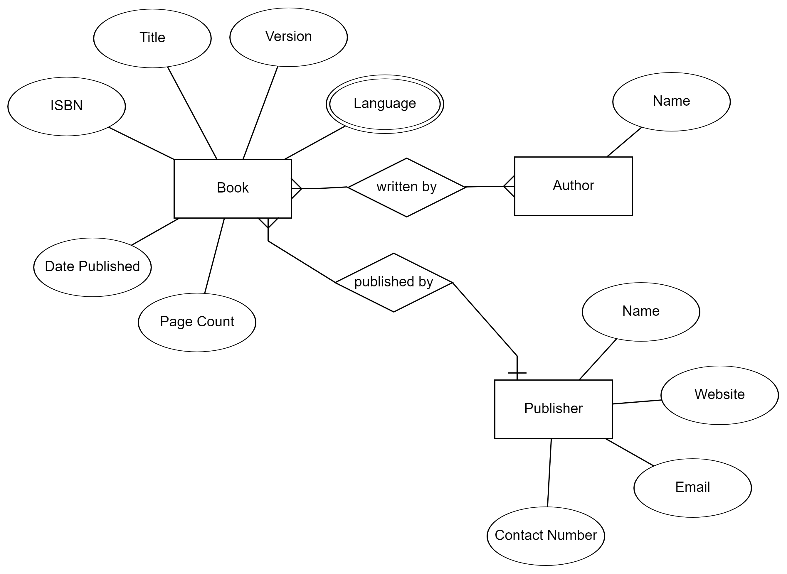

Documentation Reference: https://github.com/nadialefebvre/library

# Library System Database

This project was built as a means to learn ExpressJS in conjunction with Mongo Atlas (10 March 2023).

## Overview
This simple Javascript server acts as a basic library managemement system, allowing users to manage book loans. Users will be able to perform CRUD (Create, Delete, Update, Delete) operations on loans through a set of RESTFUL API endpoints. This application was built using the ExpressJS framework and utilises a Mongo Database for database interactions.

Here is a simple entity relationship diagram of the library system


## Getting Started

To run the Library System server,

1. Install the following packages from Node.JS (Express, CORS, DotEnv and MondoDB)
```
npm install express cors dotenv mongodb
```

2. Install Node Monitor
```
npm install -g nodemon
```

3. Start the server using Node Monitor
```
nodemon
```

The server will start and the API endpoints may be reached using tools such as Advanced REST Client, Postman or Insomnia

## Technological Stacks Used
* JavaScript
* NPM Packages (Express, CORS, DotEnv)
* Mongo Atlas Database