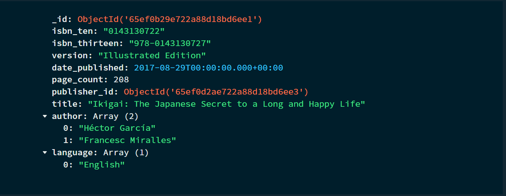
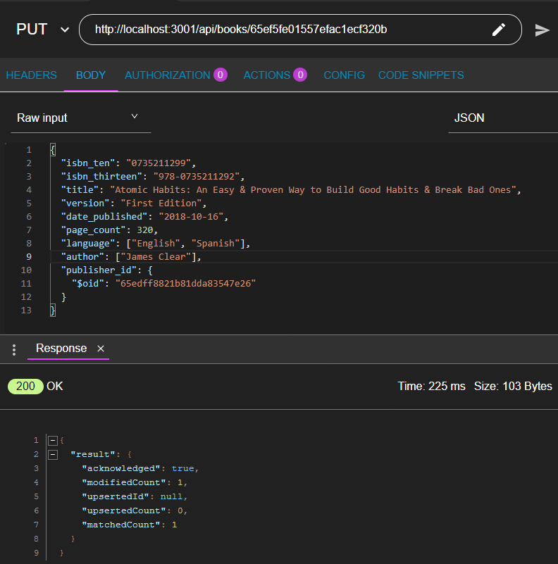
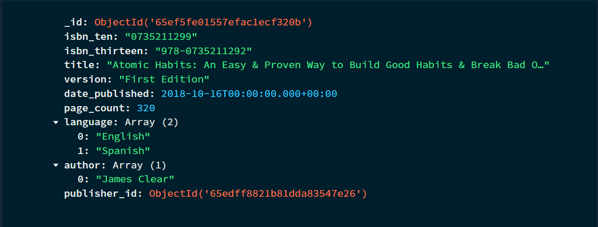
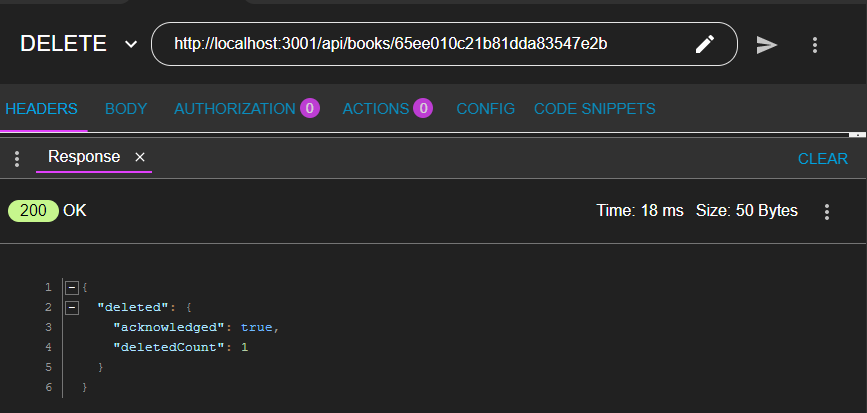
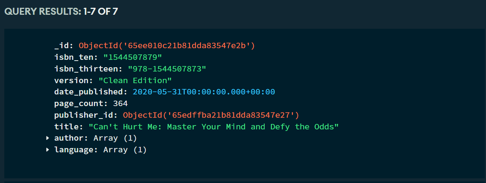
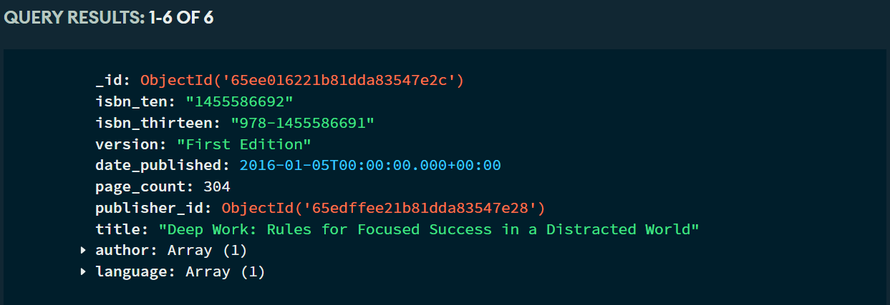
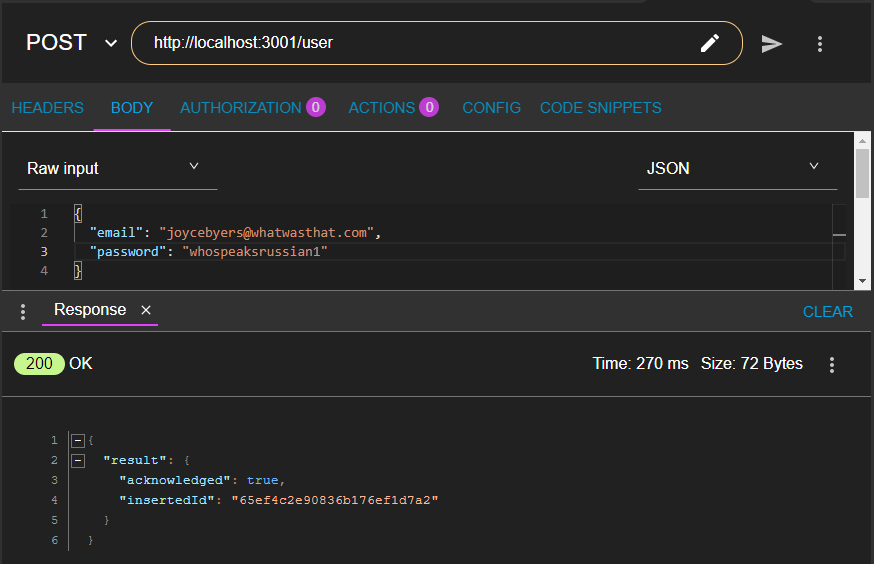
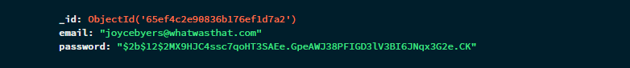
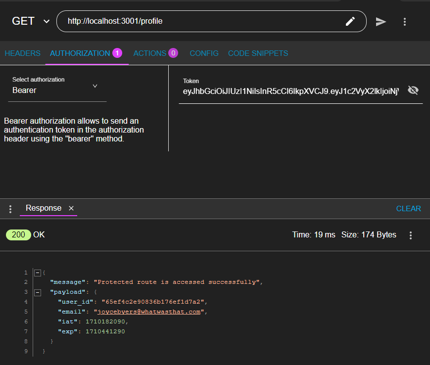
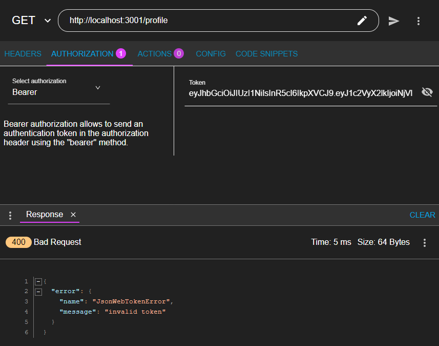

Documentation Reference: https://github.com/nadialefebvre/library

# Library System Database

This project was built as a means to learn ExpressJS in conjunction with Mongo Atlas (10 March 2023).

## Overview
This simple Javascript server acts as a basic library managemement system, allowing users to manage a collection of books. Users will be able to perform CRUD (Create, Delete, Update, Delete) operations on the books through a set of RESTFUL API endpoints. This application was built using the ExpressJS framework and utilises a Mongo Database for database interactions.

Here is a simple entity relationship diagram of the library system


## Getting Started

To run the Library System server,

1. Install the following packages from Node.JS (Express, CORS, DotEnv and MondoDB)
```
npm install express cors dotenv mongodb
```

2. Install Node Monitor
```
npm install -g nodemon
```

3. Start the server using Node Monitor
```
nodemon
```

The server will start and the API endpoints may be reached using tools such as Advanced REST Client (ARC), Postman or Insomnia

## API Endpoints
The following API endpoints are available to perform the CRUD operations.

### Books
* `GET /books` : Retrieve information of all books
* `POST /books` : Create a new book
* `PUT /books/{bookid}` : Update details of an existing book
* `DELETE /books/{bookid}` : Delete an existing book

### Users
* `POST /user` : Create a new user
* `POST /login` : Generate JSONWebToken via user login (expires in 3 days)
* `POST /profile` : Access protected route via valid JSONWebToken

## Example Usage
Here are some examples of how you can interact with the API and how it will be logged in MongoDB.

*Note: The endpoint for books in the screenshots differ from the actual endpoint. Please use the `/books` endpoint!*

### Books 
* Retrieve information of all books
```
GET http://localhost:3001/books
```
Successful retrival of book information in ARC:


Book information stored in MongoDB:


Search by author:


Search by language:


Search by publisher:


Search by title:


* Create a new book
```
POST http://localhost:3001/books
```
Successful creation of new book in ARC:


New book information stored in MongoDB:


Validation of ISBN entered:


Validation of languages and authors entered:


Validation of publisher ID entered:


Validation of other information entered:


* Update details of an existing book
```
PUT http://localhost:3001/books/{bookid}
```
Successful update of existing book information in ARC:


Existing book information (before updating languages) stored in MongoDB:


Existing book information (after updating languages) stored in MongoDB:


*Note: Validation performed when updating a book information is the same as that when a new book is created*

* Delete an existing book
```
DELETE http://localhost:3001/books/{bookid}
```
Successful deletion of existing book information in ARC:


Existing book information (before deletion) stored in MongoDB:


Existing book information (after deletion) stored in MongoDB:


### Users
* Create a new user
```
POST http://localhost:3001/user
```
Successful creation of new user in ARC:


New user information stored in MongoDB:


* Generate JSONWebToken via user login (expires in 3 days)
```
POST http://localhost:3001/login
```
Successful user login and generation of JSONWebToken in ARC:


* Access protected route via valid JSONWebToken
```
POST http://localhost:3001/profile
```
Valid JSONWebToken used to access protected route in ARC:


Invalid JSONWebToken used to access protected route in ARC:


## Technological Stacks Used
* JavaScript
* NPM Packages (Express, CORS, DotEnv, bcrypt, JSONWebToken)
* Mongo Atlas Database